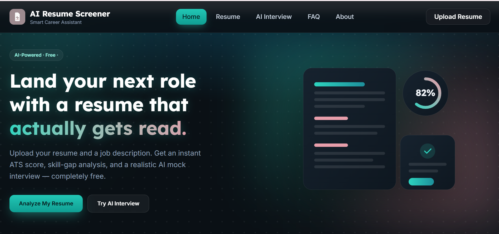
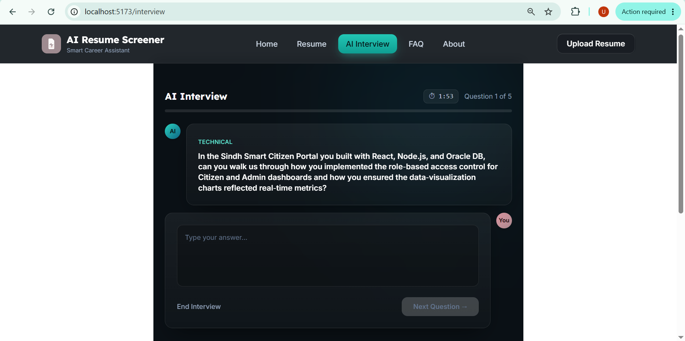

# AI Resume Screener & Mock Interview

An AI-powered web application that helps job seekers improve their resumes and interview skills.

The platform analyzes resumes against a job description, provides ATS-style feedback, generates AI-powered interview questions, evaluates user responses, and creates a detailed interview performance report.

### Home Page

### Mock Interview

## Features

- Resume Upload (PDF/DOCX)
- AI Resume Analysis
- ATS Compatibility Score
- Skills Gap Analysis
- Resume Improvement Suggestions
- AI Mock Interview
- Voice & Text Interview Modes
- AI Answer Evaluation
- Final Performance Report
- MongoDB Database Integration
- Responsive User Interface

## Tech Stack

Frontend
- React.js
- Vite
- Tailwind CSS

Backend
- Node.js
- Express.js

AI Service
- FastAPI
- Groq API
- Python

Database
- MongoDB Atlas

## Installation

1. Clone the repository
2. Install dependencies
3. Configure environment variables
4. Run Frontend
5. Run Backend
6. Run AI Service

## Future Improvements

- Authentication
- Dashboard
- Interview History
- PDF Report Export
- Company-specific Interview Modes
- Multiple Resume Templates
